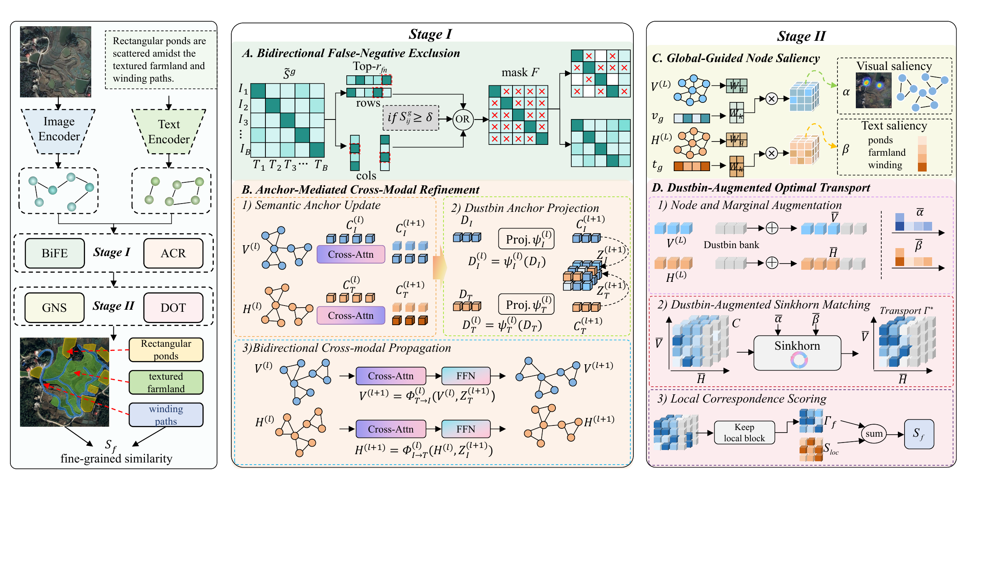
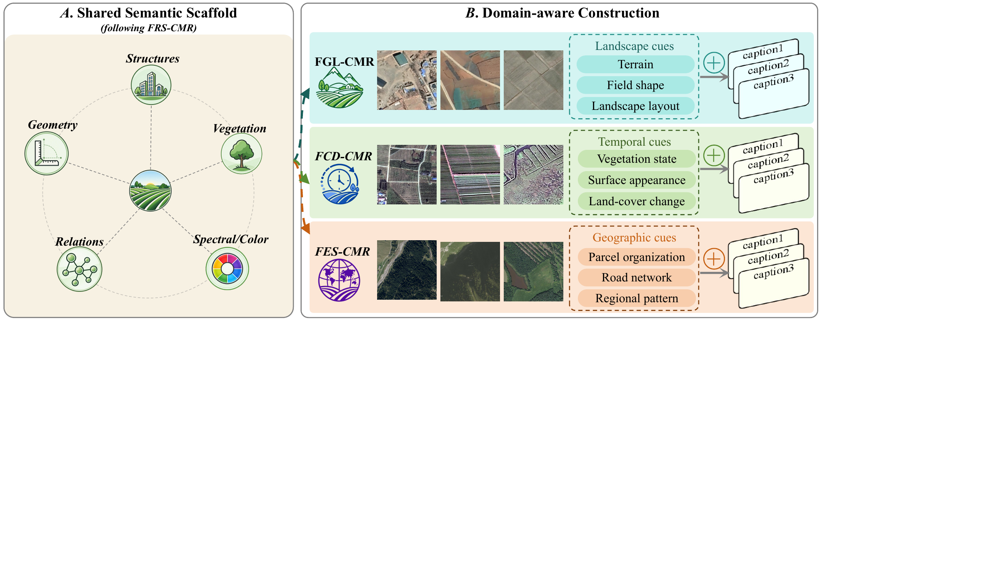
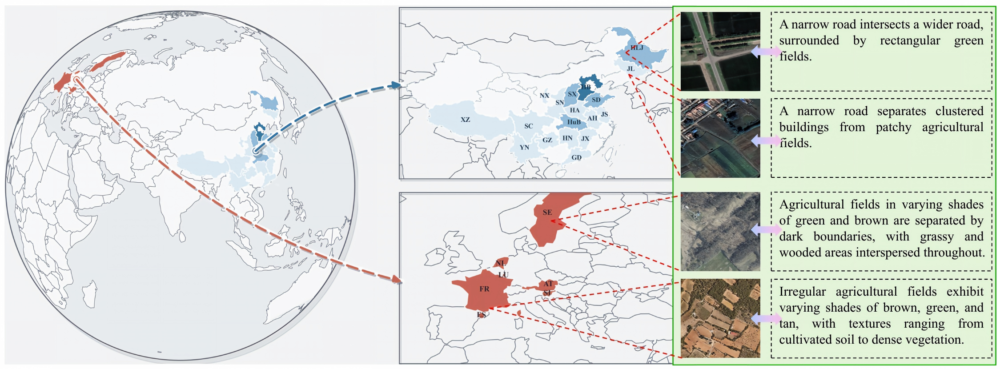
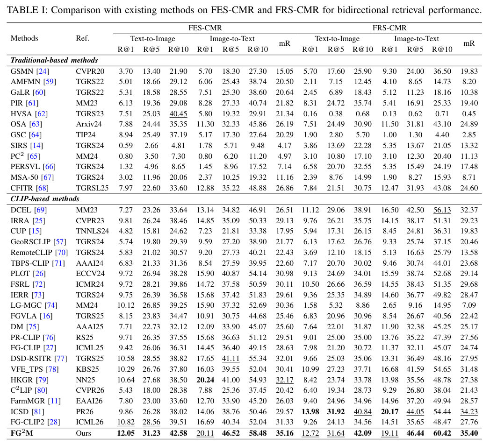
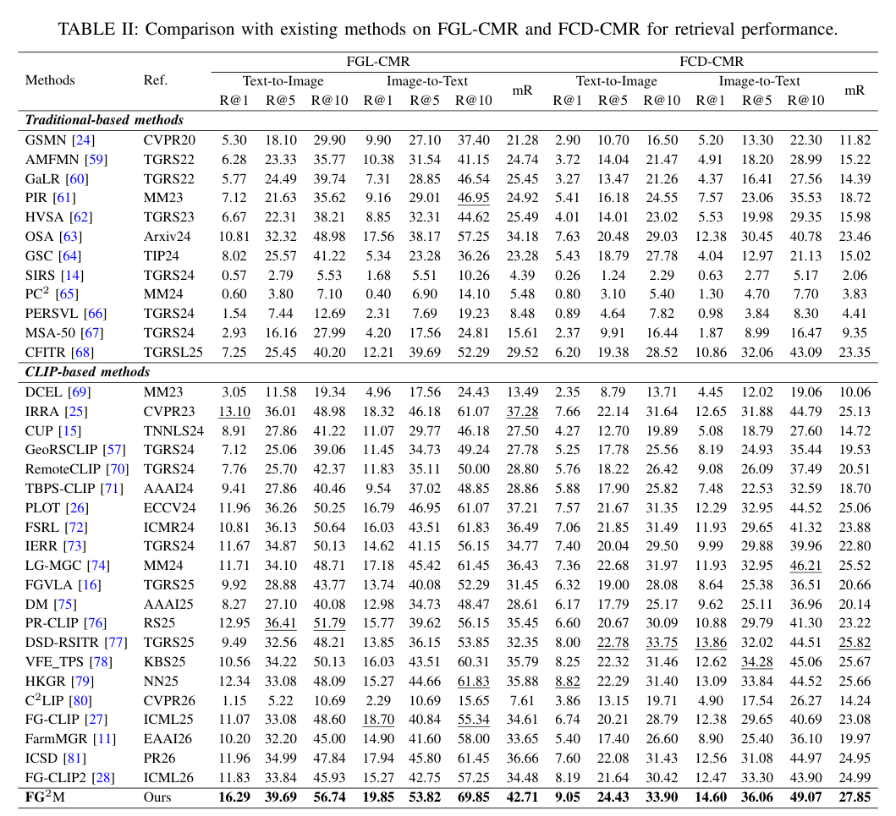
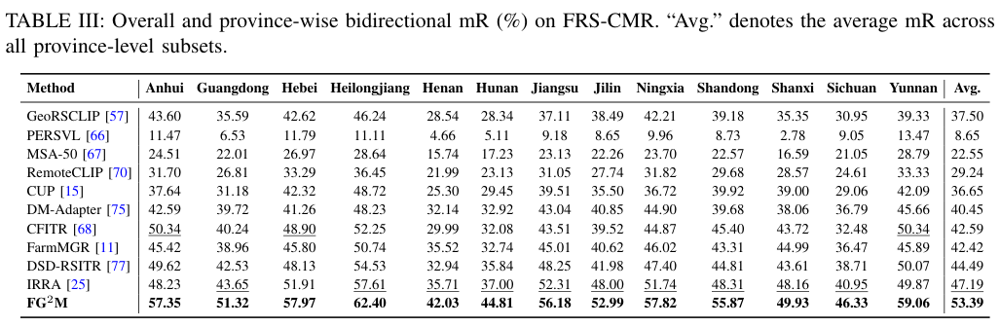

# FG²M: Reliability-Aware Fine-Grained Matching for Farmland Remote-Sensing Image–Text Retrieval

**FG²M** is a reliability-aware fine-grained matching framework for farmland remote-sensing image–text retrieval. It addresses repetitive visual patterns, partial image–text correspondence, and semantically compatible but unpaired samples.

> [!IMPORTANT]
> **Code release:** The implementation code and training scripts will be released after paper acceptance.

## Method

FG²M combines bidirectional false-negative exclusion, anchor-mediated cross-modal refinement, global-guided node saliency, and dustbin-augmented optimal transport in a two-stage retrieval framework.

## FarmR-Bench

FarmR-Bench evaluates retrieval under landscape, temporal, and geographic shifts. It contains FGL-CMR (2,606 images), FCD-CMR (11,218 images), and FES-CMR (7,598 images); each image is associated with three captions. Captions belonging to the same image remain in the same split and are treated as simultaneous positive targets.

<strong>Dataset construction</strong>

<strong>Geographic coverage</strong>

## Experimental results

The following figures reproduce the existing manuscript tables without reformatting or recalculating the reported values. Click any table to view it at full resolution.

<strong>FES-CMR and FRS-CMR</strong>

<strong>FGL-CMR and FCD-CMR</strong>

<strong>Province-wise FRS-CMR results</strong>

## Data sources

The benchmark is constructed from publicly available remote-sensing datasets. Please cite the original dataset papers: FGFD (Li *et al.*, TGRS 2025), Hi-CNA (Sun *et al.*, ISPRS J. Photogramm. Remote Sens. 2024), and AI4Boundaries (d'Andrimont *et al.*, ESSD 2023).

